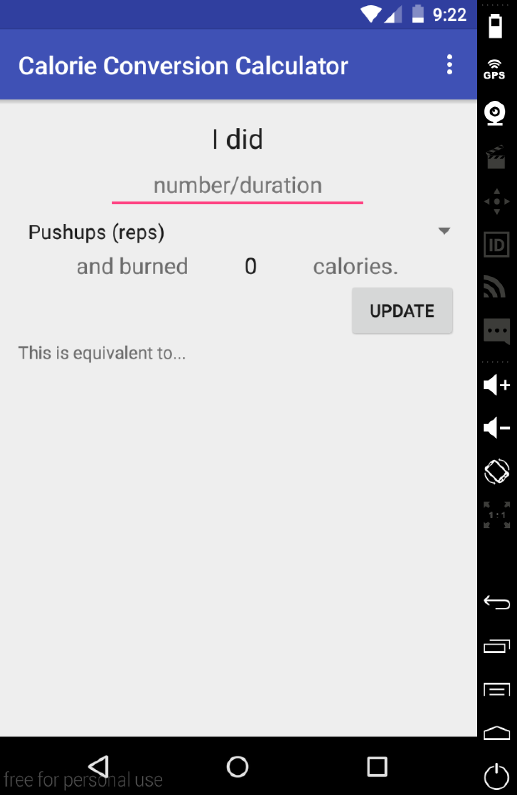
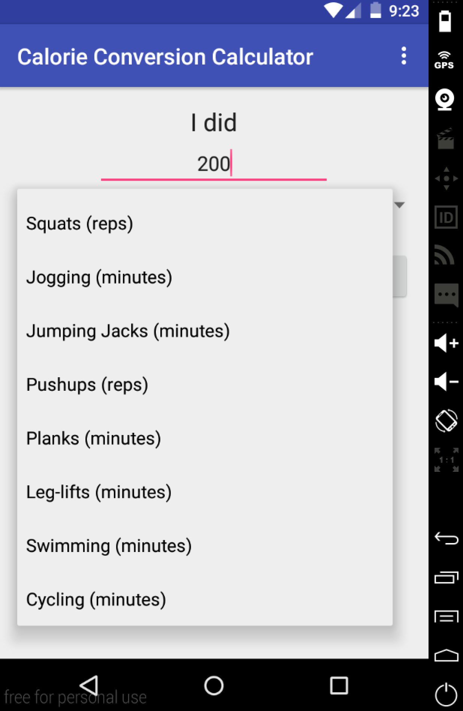
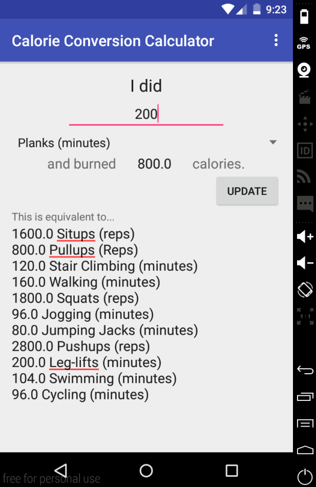

# PROG 01: Crunch Time

Enter in how much exercise you did and find out how you can diversify your workout!

## Authors

Katherine Chao ([kchao1994@berkeley.edu](mailto:kchao1994@berkeley.edu))

## Demo Video

See [the demo video]  (https://vimeo.com/154385919)

## Screenshots

# Default Screen
From here, enter in the number of reps/minutes of your exercise. Then, click on the Pushups (reps) dropdown to see all the exercise options.

# Dropdown/Spinner Selected
It’s a simple matter of selecting your exercise from here.

# Equivalencies Shown
Once the number of reps and type of exercise has been selected, hit the Update button and the number of calories you burned plus all the equivalencies of each exercise will be populated. Simply change the number/exercise type and hit Update once more to start the process over again.

*Feel free to enhance your README. For Markdown syntax, see [the GitHub Guides](https://guides.github.com/features/mastering-markdown/). Remove this line in your submission.*
